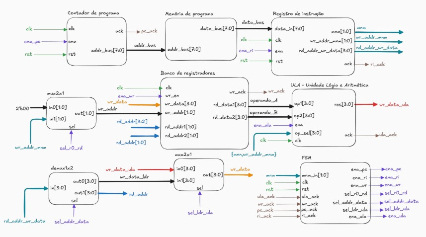
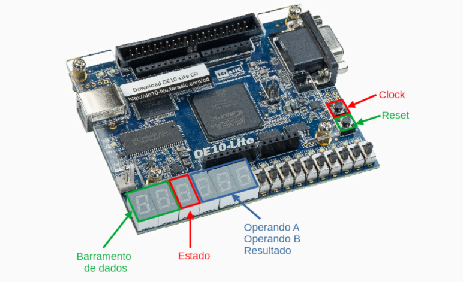

# Microcore - Processador Didático de 4-bits

O Microcore é um processador didático de 4 bits desenvolvido em Verilog para FPGAs, criado para demonstrar visualmente o funcionamento interno de uma CPU. Ele opera processando três categorias principais de instruções: Carga (Load), Operações Lógicas e Operações Aritméticas.

A função de **Carga (Load)** atua como a porta de entrada de dados da CPU, sendo responsável por buscar valores imediatos salvos na memória ROM e carregá-los de forma segura nos registradores internos (R0 a R3). Com os dados armazenados, o processador pode executar as **Funções Lógicas**, que acionam a Unidade Lógica e Aritmética (ULA) para realizar comparações bit a bit (como AND e OR). Da mesma forma, as **Funções Aritméticas** utilizam a ULA para executar cálculos matemáticos diretos (como soma e subtração) com esses valores numéricos.

Todo esse ciclo contínuo de buscar a instrução (Fetch), carregar dados, processar os cálculos e escrever o resultado de volta no banco de registradores (Write Back) pode ser acompanhado passo a passo, em tempo real, pelos displays de 7 segmentos da placa.

Este projeto foi sintetizado e validado para a placa FPGA **Intel MAX 10 (10M50DAF484C7G)** (DE10-Lite).

## Estrutura de Diretórios e Módulos

O projeto adota uma abordagem hierárquica RTL, com o módulo principal servindo como *Top-Level*.

* `microcore_top.v`: Módulo de topo que interconecta todo o *datapath* e barramentos com os periféricos da placa.
* `datapath.v`: Via de dados contendo o roteamento interno entre a ULA e os registradores.
* `control_fsm.v`: Máquina de estados que gerencia o Ciclo de Busca e Execução.
* `instruction_register.v`: Registrador de Instruções (RI) responsável por decodificar a palavra de 8-bits da ROM.
* `register_file.v`: Banco contendo os 4 registradores internos.
* `ula_4bit_sync.v`: ULA síncrona.
* `program_counter.v`: Contador de Programa (PC).
* `rom_8x256.v`: Memória ROM que carrega o código de máquina do arquivo `rom.txt`.
* `hex_to_7seg.v`: Decodificador para os displays de 7-segmentos.
* `mux_*.v / demux_*.v`: Multiplexadores e Demultiplexadores de roteamento.

---

## Conjunto de Instruções (ISA) e Funcionamento

As instruções do Microcore possuem **8-bits** de comprimento e são fatiadas pelo Registrador de Instrução (RI) em três blocos funcionais:

| Bits `[7:6]` | Bits `[5:4]` | Bits `[3:0]` |
| :---: | :---: | :---: |
| **`mnm`** (Mnemônico) | **`wr_addr_mnm`** (Destino ou Sub-operação) | **`rd_addr_wr_data`** (Imediato ou Fontes) |

A CPU decide o que fazer com base nos dois bits mais significativos, chamados de **Mnemônico (`mnm`)**:

### 1. Carga de Dados - LDR (`mnm = 00`)
Carrega um valor numérico constante (imediato) diretamente da instrução para um registrador específico. É a instrução fundamental para iniciar qualquer processamento.
* **Bits `[5:4]`:** Escolhem o registrador de destino (R0=`00`, R1=`01`, R2=`10`, R3=`11`).
* **Bits `[3:0]`:** Contêm o valor numérico imediato (de 0 a 15) que será salvo.

### 2. Operações Lógicas (`mnm = 01`)
Realiza operações bit a bit entre dois registradores usando a ULA. **Regra da Arquitetura:** O resultado de qualquer operação lógica é obrigatoriamente salvo no registrador **R0**.
* **Bits `[5:4]`:** Definem qual porta lógica será ativada (ex: OR=`00`, AND=`01`, etc.).
* **Bits `[3:2]`:** Endereço do registrador do Operando A.
* **Bits `[1:0]`:** Endereço do registrador do Operando B.

### 3. Operações Aritméticas (`mnm = 10` ou `11`)
Realiza cálculos matemáticos utilizando a ULA. Diferente das operações lógicas, o programador pode escolher livremente em qual gaveta guardar o resultado da conta.
* **Bits `[7:6]`:** Definem o tipo de conta (ex: `10` para SOMA, `11` para SUBTRAÇÃO).
* **Bits `[5:4]`:** Escolhem o registrador de destino (onde o resultado será gravado).
* **Bits `[3:2]`:** Endereço do registrador do Operando A.
* **Bits `[1:0]`:** Endereço do registrador do Operando B.

---

### Exemplos de Escrita em Código de Máquina (`rom.txt`)

Para testar o processador, você deve fornecer os comandos em **Hexadecimal** (2 dígitos por linha). Veja como a tradução acontece:

* **Exemplo 1: LDR R2 = 1**
  * *Objetivo:* Carregar o número `1` no registrador `R2`.
  * *Mnemônico:* `00` (LDR)
  * *Destino:* `10` (R2)
  * *Dado Imediato:* `0001` (Número 1)
  * *Binário:* `00100001` -> **Hexadecimal na ROM: `21`**

* **Exemplo 2: OR R0 = R1 | R2**
  * *Objetivo:* Fazer um `OR` lógico entre R1 e R2.
  * *Mnemônico:* `01` (Operação Lógica)
  * *Sub-operação:* `00` (OR)
  * *Fontes:* `01` (R1) e `10` (R2)
  * *Binário:* `01000110` -> **Hexadecimal na ROM: `46`**
* **Exemplo 3: ADD R3 = R1 + R2**
  * *Objetivo:* Somar R1 com R2 e salvar o resultado no R3.
  * *Mnemônico:* `10` (Soma)
  * *Destino:* `11` (R3)
  * *Fontes:* `01` (R1) e `10` (R2)
  * *Binário:* `10110110` -> **Hexadecimal na ROM: `B6`**

## Como Simular e Gravar na Placa

1. Clone este repositório para o seu ambiente local.
2. Crie ou edite o arquivo `rom.txt` na raiz do projeto, inserindo o seu programa em hexadecimal (uma instrução por linha).
3. Abra o projeto na ferramenta **Intel Quartus Prime**.
4. Defina o arquivo `microcore_top.v` como a *Top-Level Entity* e faça a compilação (*Compile Design*).
5. Abra o **Pin Planner** e faça a atribuição dos pinos físicos da placa DE10-Lite:
   * **Entradas:** Mapeie o botão físico de Clock (`clk`) e o botão de Reset (`rst`).
   * **Saídas (Displays 7-Seg):** Conecte os vetores de saída (`RESULTADO`, `OPERANDO_B`, `OPERANDO_A`, `ESTADO`, `INSTRUCAO1`, `INSTRUCAO2`) aos respectivos pinos dos módulos `HEX0` a `HEX5`.
6. Conecte a placa via USB, abra o **Programmer** e grave o design na FPGA via porta JTAG.